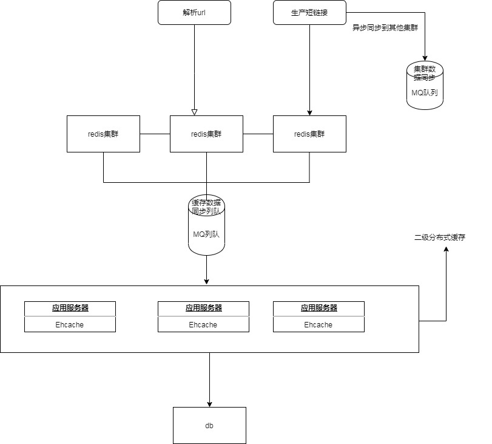

### 技术选型

1. redis目前主流。
2. ehcache作为redis的二级缓存。配合rocketmq实现分布式缓存。
3. rocketmq口碑好。可承受大数据量，良好的利用分布式特性可满足需求。
4. rdbms，分布式数据库作为数据的备份记录。

### 系统设计

考虑的点：

1.redis宕机。则为了避免rdbms一时间承受大量数据。采用ehcache二级缓存。代码未实现。

2.高并发。部署分布式无状态服务。

3.跨区域部署。

​	多集群部署，主要需解决数据同步的问题， 考虑采用消息同步机制，或者数据库主从同步机制。

分两种场景讨论集群部署问题：

- 为了容灾。如果一个集群宕机，自动切换到另一个集群，集群数据同步的消息会堆积，直到宕机集群恢复之后消费堆积的数据恢复服务。

- 为了用户访问体验。采用消息同步机制只要保证消息列队无积压，就可以实现实时同步。先发消息然后入缓存和db。这样两地的用户互相发消息，使用各自地域的短链接解析服务，同时解析同一个短链接。虽然使mq无积压风险较大，但可以根据实际情况做些mq的工作。

- 图：
  

  
